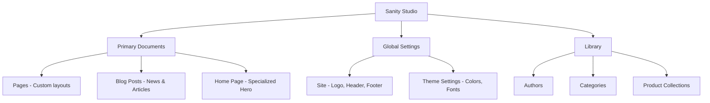

# Client Handover Document: Flagship Publication

This document is designed to help you manage your website using the Sanity CMS. The architecture is modular, meaning you can build complex pages by stacking different sections (modules) together.

---

## 1. CMS Structure Overview

The Sanity Studio is organized into several key areas. Here is a high-level map of how your content is structured:

---

## 2. Managing Site Identity & Global Elements

To update the "DNA" of your site (Logos, Menus, Colors), use the **Global Settings** section.

### Site Settings (`Site`)
*   **Site Title & Domain:** Set the base name and URL for your site.
*   **Site Logo & Favicon:** Upload your brand logo and the small icon that appears in browser tabs.
*   **Header & Footer:** 
    *   Manage navigation links.
    *   Add "Call to Action" buttons (e.g., "Join Today").
    *   Configure social media links and legal links (Privacy Policy, terms).

### Theme Settings (`Theme Settings`)
This is where you control the visual style:
*   **Colors:** Update the Primary, Secondary, and Accent colors. Changing these will instantly update the entire site.
*   **Fonts:** Specify Google Font names and embed URLs for Headings and Body text.
*   **Note:** Always use Hex codes (e.g., `#C63C22`) for colors.

---

## 3. The Page Builder (Modular System)

Most pages (under the **Pages** menu) use a **Module Builder**. Think of this like "Lego blocks" for your website.

### Common Modules:
| Module Name | Description | Use Case |
| :--- | :--- | :--- |
| **Hero Module** | Large banner with title and image. | Top of pages. |
| **Rich Text** | For long-form text content. | Standard content sections. |
| **Two Column** | Content split into two sides (e.g., Image + Text). | Diverse layouts. |
| **Feature Cards** | A row of cards with icons or images. | Services or benefits. |
| **FAQ Module** | Questions and answers (expandable). | Help or pricing pages. |
| **Real Estate** | Specific layout for property listings. | Real estate pages. |
| **Shopify Listing** | Fetches products from your Shopify store. | Shop sections. |

### How to use the Module Builder:
1.  Open a **Page** document.
2.  Scroll to the **Modules** list.
3.  Click **"Add Item"** and select the section type you want.
4.  **Drag and Drop:** You can reorder modules by clicking and dragging them in the list.

---

## 4. The Blogging System

The blog is divided into three parts:
1.  **Authors:** Create profiles for your writers.
2.  **Categories:** Tag your posts (e.g., "Travel", "Culture").
3.  **Posts:** The actual articles.
    *   Ensure you set a **Published Date**.
    *   Add a **Main Image** for the blog feed.
    *   Select an **Author** and **Categories**.

---

## 5. SEO (Search Engine Optimization)

Every **Page** and **Post** has an **SEO** tab at the bottom. **Crucial for Google ranking:**
*   **Meta Title:** Keep it under 60 characters.
*   **Meta Description:** A summary under 160 characters.
*   **Social Image:** If shared on Facebook/X, this image will be the thumbnail.

---

## 6. How to Update Navigation Menus

1.  Go to **Header** (under Site Settings).
2.  Under **Navigation Items**, add a new item.
3.  Choose between a **Simple Link** or a **Nested Dropdown**.
4.  For Dropdowns, add further sub-items.

---
