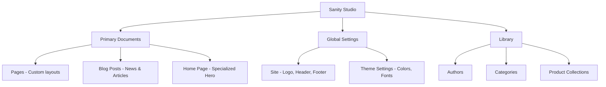

# Client Handover Document: Flagship Publication

This document is designed to help you manage your website using the Sanity CMS. The architecture is modular, meaning you can build complex pages by stacking different sections (modules) together.

---

## 1. CMS Structure Overview

The Sanity Studio is organized into several key areas. Here is a high-level map of how your content is structured:

---

## 2. Managing Site Identity & Global Elements

To update the "DNA" of your site (Logos, Menus, Colors), use the **Global Settings** section.

### Site Settings (`Site`)
*   **Site Title & Domain:** Set the base name and URL for your site.
*   **Site Logo & Favicon:** Upload your brand logo and the small icon that appears in browser tabs.
*   **Header & Footer:** 
    *   **Main Navigation:** Add links to your pages. You can use "Nested Dropdowns" for sub-menus.
    *   **Social & Legal:** Specific sections for your social media profiles and legal links (T&Cs).
    *   **Call to Action:** A dedicated primary button for the header.

### Theme Settings (`Theme Settings`)
This is the "Style Guide" of your website:
*   **Colors:** Update HEX codes for Backgrounds, Text, and Accents. (e.g., `#C63C22` for the signature red).
*   **Fonts:** You can change the typography by entering a Google Font name (e.g., `Inter`) and pasting the CSS URL from [fonts.google.com](https://fonts.google.com).
*   **Tip:** Changing a color here updates every instance of that color across the site instantly.

---

## 3. The Page Builder (Modular System)

Most pages (under the **Pages** menu) use a **Module Builder**. Think of this like "Lego blocks" for your website.

### Common Modules:
| Module Name | Description | Use Case |
| :--- | :--- | :--- |
| **Hero Module** | Large banner with title and image. | Top of pages. |
| **Rich Text** | For long-form text content. | Standard content sections. |
| **Two Column** | Content split into two sides (e.g., Image + Text). | Diverse layouts. |
| **Feature Cards** | A row of cards with icons or images. | Services or benefits. |
| **FAQ Module** | Questions and answers (expandable). | Help or pricing pages. |
| **Real Estate** | Specific layout for property listings. | Real estate pages. |
| **Shopify Listing** | Fetches products from your Shopify store. | Shop sections. |

### How to use the Module Builder:
1.  Open a **Page** document.
2.  Scroll to the **Modules** list.
3.  Click **"Add Item"** and select the section type you want.
4.  **Drag and Drop:** You can reorder modules by clicking and dragging them in the list.

---

## 4. The Blogging System

The blog is divided into three parts:
1.  **Authors:** Create profiles for your writers.
2.  **Categories:** Tag your posts (e.g., "Travel", "Culture").
3.  **Posts:** The actual articles.
    *   Ensure you set a **Published Date**.
    *   Add a **Main Image** for the blog feed.
    *   Select an **Author** and **Categories**.

---

## 5. SEO (Search Engine Optimization)

Every **Page** and **Post** has an **SEO** tab at the bottom. **Crucial for Google ranking:**
*   **Meta Title:** Keep it under 60 characters.
*   **Meta Description:** A summary under 160 characters.
*   **Social Image:** If shared on Facebook/X, this image will be the thumbnail.

---

## 7. Module Reference Guide

The website is composed of various "Modules". Below is a complete list of available modules and how to use them.

### A. Hero & Top-of-Page Sections
*   **Home Banner:** A large section with an image, title, description, and author attribution. Ideal for the main home page.
*   **Hero Module:** A standard large banner for the top of pages.
*   **Simple Banner:** A smaller, more concise version of the Hero banner.
*   **Intro With Images:** A section with a title, description, and multiple images to introduce a topic visually.

### B. Core Content Modules
*   **Rich Text:** Your primary tool for text. Supports bold, italics, lists, links, and custom text colors. Use this for articles or general information.
*   **Two Column:** Split content into two sides (left and right). Useful for mixing images and text.
*   **Image Gallery:** A grid of images. Each image can have a "Hotspot" (for cropping), a title, a location, and a photographer credit.
*   **FAQ / Nested FAQ:** Use for Question & Answer sections. Use "Nested FAQ" if you want to group questions by category.

### C. Specialized Listing Sections
*   **Real Estate Module:** Specifically for property listings. Includes a large "Lead" item on the left and a scrolling list of properties on the right.
*   **Activities Module:** Highlight travel or event activities. You can choose between an **Image** or a **Video** as the main feature.
*   **Shopify Product Listing:** Live-syncs with your Shopify store. Search for products and override descriptions specifically for the website.
*   **Current Issue:** Specialized magazine layout featuring a cover image, issue date, and a bulleted list of featured articles.
*   **Reader Favourites / Classics:** Curated list of popular articles or products with a prominent number overlay (e.g., 1, 2, 3).

### D. Interactive & Promotional
*   **Contact Us / Dynamic Form:** Add a contact form to any page. You can customize the fields (Name, Email, Message, etc.).
*   **Subscription Banner:** A call-to-action specifically for email signups (e.g., for a newsletter).
*   **Testimonials:** A section to display quotes and reviews.
*   **Team Members:** Display a grid of profiles with names, roles, and photos.
*   **Logo Cloud:** A scrolling or static list of partner/sponsor logos.

### E. Utilities
*   **CTA Banner:** A simple, high-impact banner with a Title, Image, and a Button to drive clicks.
*   **Performance Stats:** Large numbers and labels to highlight achievements (e.g., "10k+ Readers").
*   **Coverage Overview:** A map or list based section to show geographical reach.

---

## 8. Tips for a Better Website

*   **Hotspot Tool:** Every image has a "Hotspot" button. Click it and drag the blue circle to the most important part of the photo. This ensures it's never cropped out on mobile.
*   **Previewing:** Always use the "Preview" button in Sanity to see how your changes look on the actual site before clicking "Publish".
*   **SEO:** Don't forget the SEO tab at the bottom of every Page. A good Meta Title and Description help you rank higher on Google.